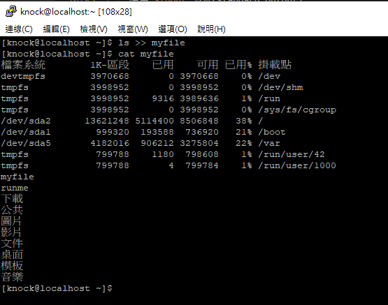
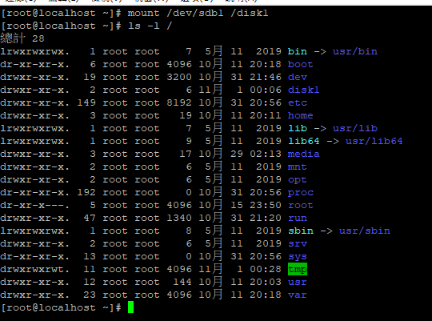
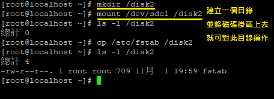
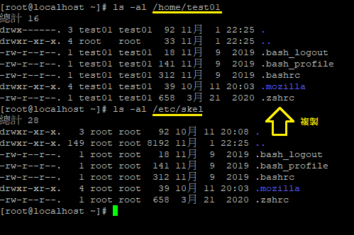
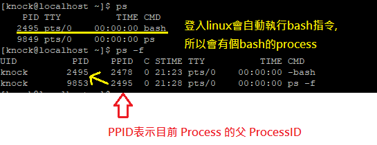
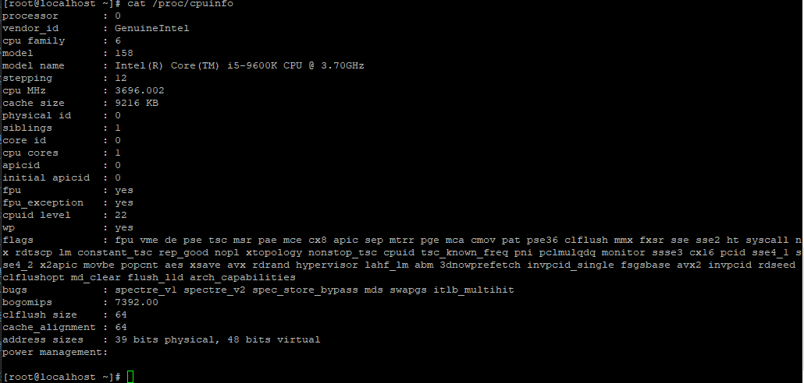

# Linux 我來教: CentOS/ RHEL 8 新世代雲端
## [課程官網](https://hahow.in/courses/5e6dd4fe024d690024e3be3e/discussions?item=5e6de2ac024d690024e3c24d)

## 第 1 章 認識與建置 Linux
### 單元 1 - 什麼是 Linux? 有很多種 Linux，特色是什麼？
  * [Linux](https://zh.wikipedia.org/zh-tw/Linux) 1991年誕生, 由UNIX衍生
  * [distrowatch](https://distrowatch.com/)網站提供目前各類Linux發行版本的統計資料
  * 發行版本是基於Linux的核心之外,再加上一些自己合用的套件與安裝的管理介面
  * [CENTOS官方網站](https://www.centos.org/)提供許通版本選擇

### 單元 2 - Linux的國際認證
  * 四大階段
      1. 操作: 懂得活用指令操作並了解知識與原理
      2. 管理: 例如:防火牆, 檔案系統, 帳號, 權限...等等
      3. 服務: 如何控制Linux裡面的服務,如何安裝好套件,如何做好一些安全性規則
      4. 解決問題: 能不能解決Linux裡面發生的一些問題,提出一些解決方案
  * 國際認證: LPIC(Linux Professional Institute), 屬於加拿大非營利單位
      * 101 (Level 1: 筆試)
      * 201,202 (Level 2: 上機考試)
      * 301, 302~306(Level 3: 上機考試):提供解決方案
  * 紅帽的國際認證: RHCSA -> RHCE
 
### 單元 3 - 什麼是光碟映像檔(ISO)?
  * 廠商釋出作業系統時,以檔案的格式釋出開機光碟,此特殊檔案是模擬一張光碟片,所以就稱為映像檔ISO格式.

### 單元 4 - 虛擬機器軟體安裝 VirtualBox : Windows
  * 虛擬機器: 在我們的電腦內安裝一個軟體,用來模擬另外一台機器的一個機制
  * 市面上常見的軟體有 VMware, [VirtualBox](https://www.virtualbox.org/)(由Sun公司發起) 這兩套軟體,點選下載平台(Windows hosts)並安裝
  * 安裝過程就是一直下一步,可能會需要管理員權限,因為需要設定網路相關的設定
  * 接者下載[CentOS 8](https://www.centos.org/download/)-->x86_64-->找DVD版本(約7gb)
  * 安裝 Red Hat 8 企業版: browser search --> [rhel 8](https://www.redhat.com/en/enterprise-linux-8) --> try it -> 試用企業版需要有帳號 -> id:knock7112@gmail.com pw:g4ru87112

### 單元 5 - 虛擬機器軟體安裝 VirtualBox : MacOS
  * MAC的VM安裝會被安全性所阻擋所以需要設置安全性(允許來自開發者Oracle America.Inc的系統軟體)

### 單元 6 - 安裝 CentOS 8.1 與瞭解磁碟分割區
  1. VirtualBox選單按下"**新增**"按鈕,就可以建立虛擬機器(類型選Linux,版本選Red Hat(64bit)),預設會安裝在C槽Users資料夾下的VirtualBox VMs資料夾內
  2. 設定記憶體至少8GB
  3. 建議硬碟使用預設的"立即建立虛擬硬碟"即可
  4. 使用預設的VDI格式(VirtualBox磁碟映像)
  5. 選擇"動態分配"
  6. 檔案位置和大小建議配置"20GB"硬碟空間
  7. 按下"建立"按鈕,即完成配置
  8. 接者點擊完成配置後的虛擬機器查看硬體配置內容並點擊選單"設定"按鈕 --> 存放裝置 -->控制器IDE (裡面顯示"空的") --> 點擊光碟機右方的光碟片圖示 --> 選擇磁碟檔 --> 設定下載好的ISO檔案 --> CentOS-8.2.2004-x86_64-dvd1.iso --> 點擊"確定"按鈕完成設定ISO檔配置
  9. 點擊選單"啟動"
  10. 當點選虛擬機器內的畫面時,滑鼠控制權會轉移到虛擬機器上,控制權無法離開,會提示要離開虛擬機器畫面需要按下右方的Ctrl才能離開
  * 進入CentOS作業系統的安裝,安裝步驟
      1. 選擇語系: ->台灣 選擇->繁體
      2. 選擇地區: ->台北
      3. 外掛軟體選擇: window檔案伺服器,除錯工具,檔案與儲存伺服器,網路檔案系統,網路伺服器,效能工具,基本網站伺服器,Legacy UNIX相容性,RPM開發工具,科學支援,安全性工具,系統工具
      4. 安裝目的地: 勾選本機標準磁碟(Linux沒有C,D,E潮概念,只有根目錄"/"),儲存裝置組態選擇"自訂" -> 手動處理分割 -> 分割規劃選擇"標準分割區" -> 點案這裡讓系統自動建立 -> 點選"/" -> 欲使用容量改成13GB -> 點選"+"設定"/var"的磁碟配置空間4GB ->完成 ->接受變更
      5. 網路與主機名: 乙太網路點選"開"(預設會使用10.0.2.15/24的配置,使用NAT)
      6. 點擊開始安裝 -> 設定根密碼(root為超級管理員) -> 創建用戶 -> knock -> 勾選讓此使用者成為管理員
      7. 安裝完成後,先將光碟機內的映像檔卸載,再點擊重新開機
  * 登入CentOS系統,使用剛剛設定的帳密,先跳過線上帳號的設定
  * 進入桌面後右側選單較常使用"終端機"來輸入命令,輸入`ifconfig`(這是舊指令,用來顯示目前Linux的網路狀態)或是輸入`ip a`(這是新指令,也是查詢網路狀態用的)
  * 想關機可以選擇右上方的按鈕->點選關機鈕-> "關閉電源"  

### 單元 7 - 安裝 Red Hat 企業版 Linux 8.2 (RHEL)
  * 安裝過程和CentOS幾乎一樣,只有最後要訂閱"RedHat軟體更新服務"不太一樣
  * 教學視訊將軟體全部選擇原本預設的配置,只有"網路部與主機名稱"需要手動按"開"啟
  * 選單多了一個叫做"CONNECT TO RED HAT",點選後進入配置並將在Red Hat官網登入時使用的帳密輸入,完成按register,會開始連到官方,完成訂閱後會以這台主機連結到red hat這個服務
  * "軟體選擇"會跳出來源已變更,再按一次確認
  * 檢查選單的"Connect to Red Hat"顯示"Registered"
  * 按下"開始安裝"並設定root密碼與新創用戶帳密
  * 完成安裝後,按下"重新開機"按鈕前,先將映像檔強制卸載,與CentOS操作一樣
  * 登入作業系統後唯一差異是會有顯示red hat的訂閱服務,完成基本設定後
  * 會有個System Registered的提示,點擊"Register System",會跳出Red Hat的訂閱畫面(這是唯一和CentOS不同的東西,其他全都一樣)

### 單元 8 - VirtualBox 的網路設定與遠端登入
  * 因為使用VirtualBox網路的關係,所以在CentOS的終端機內輸入`ip a`顯示的網路設備叫"enp0s3",ip是"10.0.2.15",像這樣的網址表示VirtualBox對目前的模擬器所使用的網路是NAT,從模擬器內部OS連到外部網路沒問題,但外部網路如果要連到模擬器內的主機是無法的,因為linux處於內部的虛擬網路,先關閉主機電源
  * 打開VirtualBox的設定畫面 -> 點選"網路" -> 目前"附加到"的設定裡面應該顯示"NAT" -> 選擇橋接介面卡(讓VirtualBox去抓實體主機上的網路卡當名稱,外部window的網路介面卡會產生新的設定,都會影響內部Linux抓IP的位置) -> 啟動
  * 再登入一次去終端機輸入`ip a`再檢視一次目前IP位置,應該會改成與外部主機類似的IP"192.168.1.111"(DHCP分配給的)
  * 一般會使用遠端服務連入Linux主機, linux預設會自動啟動一個服務"SSH",是加密的遠端登入工作  
    使用一些工具就可以連線到Linux內,遊覽器輸入pietty來下載,使用SSH客戶端的中文版,解壓並執行  
    輸入Linux的主機IP"192.168.1.111",類型選擇SSH,第一次連線會跳出提示,選擇是會儲存SSH的public key,接下來輸入帳號與密碼登入OS
  * Pietty中文顯示亂碼問題: "選項"->字元編碼->改成Unicode, "選項"->亞洲語系修正->"Unicode亞洲寬符號字元"取消勾選 -> 重開軟體再登入看看
    
## 第 2 章 Linux 基礎操作指令
### 單元 1 - Linux的開機過程
  1. 載入機器裡面的BIOS/UEFI(新式介面)來檢測硬體
  2. 找開機磁碟機的讀取程序"bootloader",硬碟啟動後選擇要載入哪一個分割區的作業系統用的,  
     他會去使用Lnux裡面的GRUB,這是Linux所使用的開機管理程式,  
     若硬碟內有多個作業系統,可提供作業系統的選單,  
     當系統出問題時,也可透過GRUB的一個設定來進入單人模式,進行系統修復,例如:忘了root密碼
  3. 載入**Kernal核心**,就是使用者和電腦之間溝通的重要程式,會在"bootloader"開機時就讀入記憶體中執行
  4. 系統接者自動執行一個服務"system",這是近年來採用的服務名稱,舊linux叫"init"服務.  
     此服務會因為我們設定linux是文字介面或是圖形介面來讀取不同的執行程式,若設定文字介面的開機,就會開在文字介面中,如同Pietty一樣,圖形介面則是由"X-Window"來處理UI上的使用者互動效果  
     CentOS和Red hat使用的圖形介面是叫"GNOME"
  *  當我們在系統中完成一些指令或是管理工作後,記得要使用指令"`logout`"登出系統

### 單元 2 - 指令操作、變身為超級使用者
  * 登入成功之後最重要的是前面的帳號資訊`[knock@localhost ~]$` 這個叫做命令提示字元(prompt)
  * linux的命令提示字元有個特殊情況,就是超級使用者和一般使用者是不一樣的.  
    一般使用者的中括號內的@前面表示登入者帳號,@後面表示主機名稱.  
    而空白後面的波浪符號的位置是目前所在的資料夾位置,在linux中的"~"表示自己的家,也就是家目錄,也就是knock這個使用者的家目錄之下
  * 輸入`pwd`命令(Present Working Directory)可以獲得當前目錄的工作路徑 
    ```bash=
    [knock@localhost ~]$ pwd
    /home/knock
    [knock@localhost ~]$
    ```
  * 有些指令是不會有回應的
  * 切換**超級使用者**輸入`su -`指令(Super user),輸入完按enter後會需要輸入密碼  
    輸入完成後提示字元的@前面會變成root,而原本的"$"字號會變成"#",是在提醒使用者已經切換成超級使用者
    ```bash=
    [knock@localhost ~]$ su -
    password:
    [root@localhost ~]#
    ```
  * 輸入`whoami`指令來查詢我是誰
    ```bash=
    [knock@localhost ~]$ whoami
    knock
    ```
  * 切換回來就輸入`exit`就會回到原來的腳色,可以用`whoami`指令確認當前使用者
  * `su -`也可以省略不輸入空白減號` -`,差異是只輸入`su`會仍然使用"knock"的環境變數,不會切換成"root"自己的環境變數.   
    因為使用者都有他獨特的環境變數,而系統的環境變數大都以全大寫的方式來命名
    ```bash=
    [knock@localhost ~]$ echo $PATH
    /home/knock/.local/bin:/home/knock/bin:/usr/local/sbin:/usr/local/bin:/usr/sbin:/usr/bin:/root/bin
    
    //未使用空白減號 -> 仍然使用knock的環境變數
    [knock@localhost ~]$ su
    password:
    [root@localhost knock]# echo $PATH
    /home/knock/.local/bin:/home/knock/bin:/usr/local/sbin:/usr/local/bin:/usr/sbin:/usr/bin:/root/bin
    
    
    //使用空白減號 -> 使用root的環境變數
    [knock@localhost ~]$ su -
    password:
    [root@localhost ~]# echo $PATH
    /usr/local/sbin:/usr/local/bin:/usr/sbin:/usr/bin:/root/bin
    ```
  * 清除畫面使用`clear`指令,或是輸入Ctrl+L鍵也可以清除畫面

### 單元 3 - 基礎資料夾切換、列表、別名
  * linux中切換資料夾要輸入`cd `指令,cd後面一定要加空白,因為後面可以接其他參數
  * linux中有兩個特殊符號`.`和`..`,直接輸入`cd .`是沒效果的.
    `.`代表是目前的資料夾,`..`代表是上一層資料夾
    ```bash=
    [knock@localhost ~]$ pwd
    /home/knock
    
    //目錄位置不變
    [knock@localhost ~]$ cd .
    
    
    //(相對位置的切換)切換到上一層資料夾
    [knock@localhost ~]$ cd ..
    [knock@localhost home]$ pwd
    /home
    [knock@localhost home]$ cd ..
    [knock@localhost /]$ pwd
    /
    
    //(絕對位置的切換,開頭使用根目錄"/")直接輸入cd /指定路徑
    [knock@localhost ~]$ cd /var
    [knock@localhost var]$ pwd
    /var
    
    //回到家目錄"~"
    [knock@localhost var]$ cd ~
    [knock@localhost ~]$
    ```
  * `ls`指令會列出目前資料夾下的檔案清單,藍色字體的資料夾,需要知道詳細內容輸入`ls -l`
    ```bash=
    [knock@localhost ~]$ ls
    下載  公共  圖片  影片  文件  桌面  模板  音樂
    [knock@localhost ~]$


    [knock@localhost ~]$ ls -l
    總計 0
    drwxr-xr-x. 2 knock knock 6 10月 11 20:19 下載
    drwxr-xr-x. 2 knock knock 6 10月 11 20:19 公共
    drwxr-xr-x. 2 knock knock 6 10月 11 20:19 圖片
    drwxr-xr-x. 2 knock knock 6 10月 11 20:19 影片
    drwxr-xr-x. 2 knock knock 6 10月 11 20:19 文件
    drwxr-xr-x. 2 knock knock 6 10月 11 20:19 桌面
    drwxr-xr-x. 2 knock knock 6 10月 11 20:19 模板
    drwxr-xr-x. 2 knock knock 6 10月 11 20:19 音樂
    [knock@localhost ~]$


    // 輸入指令ls -a才會把隱藏檔或是系統檔或隱藏資料夾都顯示出來(命令可以合併`ls -la`)
    [knock@localhost ~]$ ls -l -a
    總計 32
    drwx------. 15 knock knock 4096 10月 11 21:51 .
    drwxr-xr-x.  3 root  root    19 10月 11 20:11 ..
    -rw-------.  1 knock knock   24 10月 11 22:28 .bash_history
    -rw-r--r--.  1 knock knock   18 11月  9  2019 .bash_logout
    -rw-r--r--.  1 knock knock  141 11月  9  2019 .bash_profile
    -rw-r--r--.  1 knock knock  312 11月  9  2019 .bashrc
    drwx------. 11 knock knock  256 10月 11 20:41 .cache
    drwx------. 13 knock knock  250 10月 11 20:41 .config
    -rw-------.  1 knock knock   16 10月 11 20:19 .esd_auth
    -rw-------.  1 knock knock  624 10月 11 21:51 .ICEauthority
    drwx------.  3 knock knock   19 10月 11 20:19 .local
    drwxr-xr-x.  4 knock knock   39 10月 11 20:03 .mozilla
    drwxrw----.  3 knock knock   19 10月 11 20:19 .pki
    -rw-r--r--.  1 knock knock  658  3月 21  2020 .zshrc
    drwxr-xr-x.  2 knock knock    6 10月 11 20:19 下載
    drwxr-xr-x.  2 knock knock    6 10月 11 20:19 公共
    drwxr-xr-x.  2 knock knock    6 10月 11 20:19 圖片
    drwxr-xr-x.  2 knock knock    6 10月 11 20:19 影片
    drwxr-xr-x.  2 knock knock    6 10月 11 20:19 文件
    drwxr-xr-x.  2 knock knock    6 10月 11 20:19 桌面
    drwxr-xr-x.  2 knock knock    6 10月 11 20:19 模板
    drwxr-xr-x.  2 knock knock    6 10月 11 20:19 音樂

    ```
  * linux有準備一個叫`alias`的指令來讓很長一串的指令可以設定成另一個別名來縮短輸入
    ```bash=
    [knock@localhost ~]$ alias
    alias egrep='egrep --color=auto'
    alias fgrep='fgrep --color=auto'
    alias grep='grep --color=auto'
    alias l.='ls -d .* --color=auto'
    alias ll='ls -l --color=auto'
    alias ls='ls --color=auto'
    alias vi='vim'
    alias which='(alias; declare -f) | /usr/bin/which --tty-only --read-alias --read-functions --show-tilde --show-dot'
    alias xzegrep='xzegrep --color=auto'
    alias xzfgrep='xzfgrep --color=auto'
    alias xzgrep='xzgrep --color=auto'
    alias zegrep='zegrep --color=auto'
    alias zfgrep='zfgrep --color=auto'
    alias zgrep='zgrep --color=auto'
    [knock@localhost ~]$
    ```
  * `ls -l /`後方可以輸入指定路徑來依據指定的路徑查詢檔案清單
    ```bash=
    [knock@localhost ~]$ ls -l /
    總計 24
    lrwxrwxrwx.   1 root root    7  5月 11  2019 bin -> usr/bin
    dr-xr-xr-x.   6 root root 4096 10月 11 20:18 boot
    drwxr-xr-x.  19 root root 3140 10月 11 21:50 dev
    drwxr-xr-x. 149 root root 8192 10月 11 21:50 etc
    drwxr-xr-x.   3 root root   19 10月 11 20:11 home
    lrwxrwxrwx.   1 root root    7  5月 11  2019 lib -> usr/lib
    lrwxrwxrwx.   1 root root    9  5月 11  2019 lib64 -> usr/lib64
    drwxr-xr-x.   2 root root    6  5月 11  2019 media
    drwxr-xr-x.   2 root root    6  5月 11  2019 mnt
    drwxr-xr-x.   2 root root    6  5月 11  2019 opt
    dr-xr-xr-x. 248 root root    0 10月 11 21:50 proc
    dr-xr-x---.   5 root root  205 10月 12 00:56 root
    drwxr-xr-x.  47 root root 1340 10月 11 21:51 run
    lrwxrwxrwx.   1 root root    8  5月 11  2019 sbin -> usr/sbin
    drwxr-xr-x.   2 root root    6  5月 11  2019 srv
    dr-xr-xr-x.  13 root root    0 10月 11 21:50 sys
    drwxrwxrwt.  14 root root 4096 10月 12 01:30 tmp
    drwxr-xr-x.  12 root root  144 10月 11 20:03 usr
    drwxr-xr-x.  23 root root 4096 10月 11 20:18 var
    [knock@localhost ~]$

    ```
 
### 單元 4 - Linux主要目錄與辨讀權限
  * Linux的根目錄有幾個主要的目錄是比較重要的,只有root這個權限才能進入作特殊操作
    1. `bin`: 表示可執行檔,也就是內容是binary機器碼的檔案, 對應到usr/bin目錄
    2. `sbin`: 放系統管理相關的可執行檔(super user binary),此為系統管理員專用的執行檔, 例如:關機, 網路管理, 改變磁碟機...
    3. `etc`: 放所有系統設定檔,大都是純文字檔,只有系統管理員可修改這些檔案
    4. `dev`: 放系統設備(device)或裝置相關的檔案
    5. `home`: 所有使用者的家目錄, linux上有多少個帳號,此目錄下就會有多少個使用者目錄
    6. `root`: 系統管理員(超級使用者 super user)root的家目錄
    7. `usr`: 套件軟體(packages)大部分都安裝在此目錄下
    8. `var`: 放變動性高或系統等待排隊處理的檔案, 例如: 登入系統產生的log,連線log, email fail log,資料庫的數據 ...
    9. `opt`: 非linux預設安裝的外來軟體
  * `ls -l /`檔案列表的說明
    ```bash=
    [knock@localhost ~]$ ls -l /
    總計 24
    lrwxrwxrwx.   1 root root    7  5月 11  2019 bin -> usr/bin
    // bin: 表示可執行檔,也就是內容是binary機器碼的檔案, 對應到usr/bin目錄
    dr-xr-xr-x.   6 root root 4096 10月 11 20:18 boot
    drwxr-xr-x.  19 root root 3140 10月 12 12:49 dev
    // dev: 放系統設備(device)或裝置相關的檔案
    drwxr-xr-x. 149 root root 8192 10月 12 12:49 etc
    // etc: 放所有系統設定檔,大都是純文字檔,只有系統管理員可修改這些檔案
    drwxr-xr-x.   3 root root   19 10月 11 20:11 home
    // home: 所有使用者的家目錄, linux上有多少個帳號,此目錄下就會有多少個使用者目錄
    lrwxrwxrwx.   1 root root    7  5月 11  2019 lib -> usr/lib
    lrwxrwxrwx.   1 root root    9  5月 11  2019 lib64 -> usr/lib64
    drwxr-xr-x.   2 root root    6  5月 11  2019 media
    drwxr-xr-x.   2 root root    6  5月 11  2019 mnt
    drwxr-xr-x.   2 root root    6  5月 11  2019 opt
    dr-xr-xr-x. 184 root root    0 10月 12 12:49 proc
    dr-xr-x---.   5 root root  205 10月 12 00:56 root
    // root: 系統管理員(超級使用者 super user)root的家目錄
    drwxr-xr-x.  46 root root 1320 10月 12 12:49 run
    lrwxrwxrwx.   1 root root    8  5月 11  2019 sbin -> usr/sbin
    // sbin: 放系統管理相關的可執行檔(super user binary),此為系統管理員專用的執行檔, 例如:關機, 網路管理, 改變磁碟機...
    drwxr-xr-x.   2 root root    6  5月 11  2019 srv
    dr-xr-xr-x.  13 root root    0 10月 12 12:49 sys
    drwxrwxrwt.  12 root root 4096 10月 12 12:59 tmp
    drwxr-xr-x.  12 root root  144 10月 11 20:03 usr
    // usr: 套件軟體(packages)大部分都安裝在此目錄下
    drwxr-xr-x.  23 root root 4096 10月 11 20:18 var
    [knock@localhost ~]$
    ```
  *  [Linux檔案屬性](http://linux.vbird.org/linux_basic/0210filepermission.php)  
    
  * 在linux環境內與機器的互動會有一支shell程序來跟linux作互動叫"bash"
    
  * 在linux可執行檔案沒有所謂的附檔名(.exe),而是要看檔案屬性是否有"x"可執行的狀態  
    可執行檔都放在**根目錄的bin**之下
    ```bash=
    [knock@localhost ~]$ ls /bin | more
    [
    ab
    abrt-action-analyze-backtrace
    abrt-action-analyze-c
    abrt-action-analyze-ccpp-local
    abrt-action-analyze-core
    abrt-action-analyze-oops
    abrt-action-analyze-python
    abrt-action-analyze-vmcore
    abrt-action-analyze-vulnerability
    abrt-action-analyze-xorg
    abrt-action-check-oops-for-alt-component
    abrt-action-check-oops-for-hw-error
    abrt-action-generate-backtrace
    abrt-action-generate-core-backtrace
    abrt-action-install-debuginfo
    abrt-action-list-dsos
    abrt-action-notify
    abrt-action-perform-ccpp-analysis
    abrt-action-save-package-data
    abrt-action-trim-files
    abrt-cli
    abrt-dump-journal-core
    ...
    ```
### 單元 5 - 關機與重啟系統，sudo指令
  * 如何查看線上有多少使用者已經登入在系統中可用`w`指令,或用`who`指令
    ```bash=
    [root@localhost ~]# w
    14:02:55 up  1:13,  2 users,  load average: 0.00, 0.02, 0.00
    USER     TTY      FROM             LOGIN@   IDLE   JCPU   PCPU WHAT
    knock    pts/0    192.168.1.104    13:03    4.00s  0.08s  0.08s -bash
    root     pts/1    192.168.1.104    14:02    0.00s  0.02s  0.00s w
    [root@localhost ~]# who
    knock    pts/0        2020-10-12 13:03 (192.168.1.104)
    root     pts/1        2020-10-12 14:02 (192.168.1.104)
    [root@localhost ~]#
    ```
  * 重新啟動機器的指令是`shutdown`  
    使用系統管理員作關機操作和取消關機操作
    ```bash=
    // -h : (halt)表示直接關機, 10:表示10分鐘後才關機(進入排程), 後面訊息是要廣播的指定內容
    [root@localhost ~]# shutdown -h 10 "please backup your job"
    Shutdown scheduled for Mon 2020-10-12 14:11:51 CST, use 'shutdown -c' to cancel.
    [root@localhost ~]# shutdown -c
    ```
    另一個正在遠端操作的使用者也會收到關機的系統資訊
    ```bash=
    [knock@localhost ~]$
    Broadcast message from root@localhost.localdomain on pts/1 (Mon 2020-10-12 14:10:51 CST):

    please backup your job
    The system is going down for poweroff at Mon 2020-10-12 14:11:51 CST!


    Broadcast message from root@localhost.localdomain on pts/1 (Mon 2020-10-12 14:11:25 CST):

    The system shutdown has been cancelled


    [knock@localhost ~]$
    ```

  * shell程序在輸入指令時可以按tab鍵來快速列出目前符合的指令
    ```bash=
    [root@localhost ~]# shu
    shuf      shutdown
    ```
  * `reboot`指令也可以關機,enter按下去就立即重新開機
  * 若不想切到super user但又需要用super user的身分(前提是user帳號有設定管理員權限),  
    可用`sudo`指令,表示暫時性使用管理者身分來執行操作,第一次執行會需要輸入密碼,之後就不用了  
    ```bash=
    [knock@localhost ~]$ sudo shutdown -h 10

    我們相信您已經從本機系統管理員取得
    日常注意事項。注意事項通常可以歸結為三件事情：

        #1) 尊重他人隱私。
        #2) 輸入指令前先三思。
        #3) 權力越大則責任越大。

    [sudo] knock 的密碼：
    Shutdown scheduled for Mon 2020-10-12 14:33:12 CST, use 'shutdown -c' to cancel.
    ```

### 單元 6 - 基本檔案操作 - 複製、搬移、刪除
  * 檔案複製指令`cp`,後面要帶入兩個參數,第1個是來源路徑,第2個是目的地路徑  
    ```bash=
    // 目的地的參數帶入"."表示目的地是當前目錄之下
    [knock@localhost ~]$ cp /etc/fstab .
    [knock@localhost ~]$ ls -l
    總計 4
    // 這樣就把fstab檔案從 /etc 複製到 /home/knock 之下
    -rw-r--r--. 1 knock knock 709 10月 12 14:43 fstab
    drwxr-xr-x. 2 knock knock   6 10月 11 20:19 下載
    drwxr-xr-x. 2 knock knock   6 10月 11 20:19 公共
    drwxr-xr-x. 2 knock knock   6 10月 11 20:19 圖片
    drwxr-xr-x. 2 knock knock   6 10月 11 20:19 影片
    drwxr-xr-x. 2 knock knock   6 10月 11 20:19 文件
    drwxr-xr-x. 2 knock knock   6 10月 11 20:19 桌面
    drwxr-xr-x. 2 knock knock   6 10月 11 20:19 模板
    drwxr-xr-x. 2 knock knock   6 10月 11 20:19 音樂
    [knock@localhost ~]$
    ```
  * 當想透過tab快速列出目前可用的檔案時,若檔案過多可連按兩次tab,會跳出提示
    ```bash=
    //當輸入來源路徑並按下 tab 鍵兩次時,因為檔案過多會跳出提示
    [knock@localhost ~]$ cp /etc/
    Display all 293 possibilities? (y or n)
    abrt/                       microcode_ctl/
    adjtime                     mime.types
    aliases                     mke2fs.conf
    alsa/                       modprobe.d/
    alternatives/               modules-load.d/
    anacrontab                  motd
    asound.conf                 motd.d/
    at.deny                     mtab
    audit/                      mtools.conf
    authselect/                 multipath/
    autofs.conf                 my.cnf
    autofs_ldap_auth.conf       my.cnf.d/
    auto.master                 nanorc
    auto.master.d/              ndctl/
    auto.misc                   netconfig
    auto.net                    NetworkManager/
    auto.smb                    networks
    avahi/                      nfs.conf
    bash_completion.d/          nfsmount.conf
    bashrc                      nftables/
    bindresvport.blacklist      nsswitch.conf
    binfmt.d/                   nsswitch.conf.bak
    bluetooth/                  oddjob/
    --More--
    ```
  * 想看純文字內容可以用`cat`指令
    ```bash=
    [knock@localhost ~]$ cat fstab

    #
    # /etc/fstab
    # Created by anaconda on Sun Oct 11 08:02:48 2020
    #
    # Accessible filesystems, by reference, are maintained under '/dev/disk/'.
    # See man pages fstab(5), findfs(8), mount(8) and/or blkid(8) for more info.
    #
    # After editing this file, run 'systemctl daemon-reload' to update systemd
    # units generated from this file.
    #
    UUID=56b7da25-39da-4c31-9f46-35b568c3ea00 /                       xfs     defaults        0 0
    UUID=63546e57-1f65-4aa0-ab1c-0458500b3d83 /boot                   ext4    defaults        1 2
    UUID=a8eba0dc-b546-4229-a51f-7dd27ba620ff /var                    xfs     defaults        0 0
    UUID=1ff081ce-dfcd-41d1-b98c-44766a52dbe7 swap                    swap    defaults        0 0
    [knock@localhost ~]$
    ```
  * 複製檔案內容並重新命名檔案名稱
    ```bash=
    // 把當前目錄內的fstab檔案內容複製到一個新的檔案並且將檔案名稱設定為aaa
    [knock@localhost ~]$ cp fstab aaa
    [knock@localhost ~]$ ls -l
    總計 8
    -rw-r--r--. 1 knock knock 709 10月 12 14:55 aaa
    -rw-r--r--. 1 knock knock 709 10月 12 14:43 fstab
    drwxr-xr-x. 2 knock knock   6 10月 11 20:19 下載
    drwxr-xr-x. 2 knock knock   6 10月 11 20:19 公共
    drwxr-xr-x. 2 knock knock   6 10月 11 20:19 圖片
    drwxr-xr-x. 2 knock knock   6 10月 11 20:19 影片
    drwxr-xr-x. 2 knock knock   6 10月 11 20:19 文件
    drwxr-xr-x. 2 knock knock   6 10月 11 20:19 桌面
    drwxr-xr-x. 2 knock knock   6 10月 11 20:19 模板
    drwxr-xr-x. 2 knock knock   6 10月 11 20:19 音樂
    [knock@localhost ~]$
    ```
  * 移動檔案到其他資料夾使用`mv`指令,後面參數帶兩個,第1個示來源檔案,第2個是目的地路徑
    也可用來改變檔案名稱,例如將檔案aaa改成bbb就輸入`mv aaa bbb`
    ```bash=
    // 把檔案aaa從當前目錄複製到/tmp之下
    [knock@localhost ~]$ mv aaa /tmp
    [knock@localhost ~]$ ls -l /tmp
    總計 20
    -rw-r--r--. 1 knock knock  709 10月 12 14:55 aaa
    -rw-r--r--. 1 root  root  1787 10月 11 20:19 anaconda.log
    -rw-r--r--. 1 root  root  2942 10月 11 20:18 dbus.log
    -rw-r--r--. 1 root  root     0 10月 11 20:18 ifcfg.log
    -rwx------. 1 root  root  1379 10月 11 20:12 ks-script-kwyrh_vw
    -rw-r--r--. 1 root  root     0 10月 11 20:18 packaging.log
    -rw-r--r--. 1 root  root   131 10月 11 20:18 program.log
    -rw-r--r--. 1 root  root     0 10月 11 20:18 sensitive-info.log
    -rw-r--r--. 1 root  root     0 10月 11 20:18 storage.log
    drwx------. 3 root  root    17 10月 12 14:19 systemd-private-1a0b73f820574a9fbe803605c05bc57c-colord.service-qUfwa2
    drwx------. 3 root  root    17 10月 12 14:19 systemd-private-1a0b73f820574a9fbe803605c05bc57c-ModemManager.service-4CPf08
    drwx------. 3 root  root    17 10月 12 14:19 systemd-private-1a0b73f820574a9fbe803605c05bc57c-rtkit-daemon.service-0eu9mK
    drwx------. 2 knock knock    6 10月 11 20:20 tracker-extract-files.1000
    [knock@localhost ~]$
    ```
  * 刪除檔案使用`rm`指令
    ```bash=
    [knock@localhost ~]$ rm /tmp/aaa
    [knock@localhost ~]$ ls -l /tmp
    總計 16
    -rw-r--r--. 1 root  root  1787 10月 11 20:19 anaconda.log
    -rw-r--r--. 1 root  root  2942 10月 11 20:18 dbus.log
    -rw-r--r--. 1 root  root     0 10月 11 20:18 ifcfg.log
    -rwx------. 1 root  root  1379 10月 11 20:12 ks-script-kwyrh_vw
    -rw-r--r--. 1 root  root     0 10月 11 20:18 packaging.log
    -rw-r--r--. 1 root  root   131 10月 11 20:18 program.log
    -rw-r--r--. 1 root  root     0 10月 11 20:18 sensitive-info.log
    -rw-r--r--. 1 root  root     0 10月 11 20:18 storage.log
    drwx------. 3 root  root    17 10月 12 14:19 systemd-private-1a0b73f820574a9fbe803605c05bc57c-colord.service-qUfwa2
    drwx------. 3 root  root    17 10月 12 14:19 systemd-private-1a0b73f820574a9fbe803605c05bc57c-ModemManager.service-4CPf08
    drwx------. 3 root  root    17 10月 12 14:19 systemd-private-1a0b73f820574a9fbe803605c05bc57c-rtkit-daemon.service-0eu9mK
    drwx------. 2 knock knock    6 10月 11 20:20 tracker-extract-files.1000
    ```
  * 建立資料夾使用`mkdir`指令, 後面參數表示資料夾名稱
    ```bash=
    [knock@localhost ~]$ mkdir test01
    [knock@localhost ~]$ ls -l
    總計 0
    drwxrwxr-x. 2 knock knock 6 10月 12 15:07 test01
    drwxr-xr-x. 2 knock knock 6 10月 11 20:19 下載
    drwxr-xr-x. 2 knock knock 6 10月 11 20:19 公共
    drwxr-xr-x. 2 knock knock 6 10月 11 20:19 圖片
    drwxr-xr-x. 2 knock knock 6 10月 11 20:19 影片
    drwxr-xr-x. 2 knock knock 6 10月 11 20:19 文件
    drwxr-xr-x. 2 knock knock 6 10月 11 20:19 桌面
    drwxr-xr-x. 2 knock knock 6 10月 11 20:19 模板
    drwxr-xr-x. 2 knock knock 6 10月 11 20:19 音樂
    ```
  * 刪除資料夾可使用`rmdir`或`rm`指令,但若資料夾內非空的就無法刪除,若要刪除需要帶參數`-f`表示強制刪除, `-r`表示遞迴,就是一層一層跑
    ```bash=
    // rmdir和rm都無法刪除非空的資料夾
    [knock@localhost ~]$ rmdir test01
    rmdir: failed to remove 'test01': 目錄不是空的
    [knock@localhost ~]$ rm test01
    rm: 無法移除 'test01': 是個目錄
    [knock@localhost ~]$ rm -f test01
    rm: 無法移除 'test01': 是個目錄

    // 輸入 -rf 強制刪除test01與裡面所有的內容,不會跳出任何提示或訊息
    [knock@localhost ~]$ rm -rf test01
    [knock@localhost ~]$
    ```

### 單元 7 - 學怎麼用Linux，而不是背指令
  * 思考方式先想要做啥,再來查指令

## 第 3 章 Linux 的檔案系統
### 單元 1 - XFS檔案系統
  * CentOS 6使用的檔案系統是Ext2->Ext3(加上日誌功能)->Ext4  
    因為Ext2版本在停電重開後,需要去掃描目前檔案內的一些變動和狀況,  
    而Ext3把變動資訊都記錄起來,節省傳統需掃描整顆硬碟所要耗費的時間,  
    當停電復工後,只需要掃描日誌內有變動的檔案,效能就會提升  
    Ext4檔案最大可達1EB(1000PB)
  * CentOS 7,8使用的檔案系統是XFS(檔案最大可達8EB)
  * `xfs`相關的指令如下,以下指令只有超級管理員才能執行
    ```bash=
    [knock@localhost ~]$ xfs
    xfs_admin      xfs_estimate   xfsinvutil     xfs_mkfile     xfs_rtcp
    xfs_bmap       xfs_freeze     xfs_io         xfs_ncheck     xfs_spaceman
    xfs_copy       xfs_fsr        xfs_logprint   xfs_quota
    xfs_db         xfs_growfs     xfs_mdrestore  xfs_repair
    xfsdump        xfs_info       xfs_metadump   xfsrestore
    [knock@localhost ~]$ xfs
    ```
### 單元 2 - 認識 inode
  * [檔案資訊紀錄檔"inode"](https://linux.vbird.org/linux_basic_train/centos8/unit06.php#6.1)
    * 記錄檔案的屬性，一個檔案佔用一個inode，同時記錄此檔案的資料所在的 block 號碼
    * 檔名,更動時間,權限與檔案儲存的區塊位置等資料
    * 每個inode都有唯一編號
    * `ls -i`指令可列出inode的編號
        ```bash=
        [knock@localhost ~]$ ls -il
        總計 0
        // 第一個就是inode的編號
        27774161 drwxr-xr-x. 2 knock knock 6 10月 11 20:19 下載
        9651884 drwxr-xr-x. 2 knock knock 6 10月 11 20:19 公共
        3413527 drwxr-xr-x. 2 knock knock 6 10月 11 20:19 圖片
        9651885 drwxr-xr-x. 2 knock knock 6 10月 11 20:19 影片
        18512867 drwxr-xr-x. 2 knock knock 6 10月 11 20:19 文件
        18512866 drwxr-xr-x. 2 knock knock 6 10月 11 20:19 桌面
        3413526 drwxr-xr-x. 2 knock knock 6 10月 11 20:19 模板
        27774162 drwxr-xr-x. 2 knock knock 6 10月 11 20:19 音樂
        ```
    * linux中的inode是有數量限制的,輸入`df -i`指令可查詢目前磁碟上inode的使用狀態  
      當檔案很小又很多就可能耗盡inode,造成磁碟空間足夠但無法寫入
        ```bash=
        [knock@localhost ~]$ df -i
        檔案系統         Inode  I已用   I可用 I已用% 掛載點
        devtmpfs        992667    380  992287     1% /dev
        tmpfs           999738      1  999737     1% /dev/shm
        tmpfs           999738    747  998991     1% /run
        tmpfs           999738     17  999721     1% /sys/fs/cgroup
        /dev/sda2      6815744 152980 6662764     3% /
        /dev/sda5      2096128   8026 2088102     1% /var
        /dev/sda1        65536    309   65227     1% /boot
        tmpfs           999738     23  999715     1% /run/user/42
        tmpfs           999738     11  999727     1% /run/user/0
        tmpfs           999738     11  999727     1% /run/user/1000
        [knock@localhost ~]$
        ```
    

### 單元 3 - 檔案系統相關指令與操作說明
  * 要了解目前檔案系統的掛載狀況使用`cat /etc/fstab`指令查詢fstab檔案內的資訊  
    可以看到根目錄是使用xfs方式來掛載,而/boot目錄使用Ext4,因為boot是放linux的開機核心檔
    ```bash=
    [root@localhost ~]# cat /etc/fstab

    #
    # /etc/fstab
    # Created by anaconda on Sun Oct 11 08:02:48 2020
    #
    # Accessible filesystems, by reference, are maintained under '/dev/disk/'.
    # See man pages fstab(5), findfs(8), mount(8) and/or blkid(8) for more info.
    #
    # After editing this file, run 'systemctl daemon-reload' to update systemd
    # units generated from this file.
    #
    UUID=56b7da25-39da-4c31-9f46-35b568c3ea00 /                       xfs     defaults        0 0
    UUID=63546e57-1f65-4aa0-ab1c-0458500b3d83 /boot                   ext4    defaults        1 2
    UUID=a8eba0dc-b546-4229-a51f-7dd27ba620ff /var                    xfs     defaults        0 0
    UUID=1ff081ce-dfcd-41d1-b98c-44766a52dbe7 swap                    swap    defaults        0 0
    ```
  * 使用`df`指令可查詢目前檔案系統掛載的狀態
    ```bash=
    // 以下數字單位均是kb,需要自己換算成gb
    [root@localhost ~]# df
    檔案系統        1K-區段    已用    可用 已用% 掛載點
    devtmpfs        3970668       0 3970668    0% /dev
    tmpfs           3998952       0 3998952    0% /dev/shm
    tmpfs           3998952    9344 3989608    1% /run
    tmpfs           3998952       0 3998952    0% /sys/fs/cgroup
    /dev/sda2      13621248 5114272 8506976   38% /
    /dev/sda5       4182016  894076 3287940   22% /var
    /dev/sda1        999320  193588  736920   21% /boot
    tmpfs            799788    1180  798608    1% /run/user/42
    tmpfs            799788       4  799784    1% /run/user/0
    tmpfs            799788       4  799784    1% /run/user/1000

    // -h參數表示human readable,會轉換成人類比較易懂的方式
    [root@localhost ~]# df -h
    檔案系統        容量  已用  可用 已用% 掛載點
    devtmpfs        3.8G     0  3.8G    0% /dev
    tmpfs           3.9G     0  3.9G    0% /dev/shm
    tmpfs           3.9G  9.2M  3.9G    1% /run
    tmpfs           3.9G     0  3.9G    0% /sys/fs/cgroup
    /dev/sda2        13G  4.9G  8.2G   38% /
    /dev/sda5       4.0G  874M  3.2G   22% /var
    /dev/sda1       976M  190M  720M   21% /boot
    tmpfs           782M  1.2M  780M    1% /run/user/42
    tmpfs           782M  4.0K  782M    1% /run/user/0
    tmpfs           782M  4.0K  782M    1% /run/user/1000
    ```
  * 使用`man`指令(manual:操作手冊)後面帶入要查詢的指令可以獲得指令的操作手冊,指令的操作手冊在安裝系統時就都放入系統中了
    ```bash=
    DF(1)                                         User Commands                                         DF(1)

    NAME
        df - report file system disk space usage

    SYNOPSIS
        df [OPTION]... [FILE]...

    DESCRIPTION
        This  manual page documents the GNU version of df.  df displays the amount of disk space available
        on the file system containing each file name argument.  If no file name is given, the space avail‐
        able on all currently mounted file systems is shown.  Disk space is shown in 1K blocks by default,
        unless the environment variable POSIXLY_CORRECT is set, in which case 512-byte blocks are used.

        If an argument is the absolute file name of a disk device node containing a mounted  file  system,
        df  shows  the  space  available on that file system rather than on the file system containing the
        device node.  This version of df cannot show  the  space  available  on  unmounted  file  systems,
        because  on  most  kinds  of systems doing so requires very nonportable intimate knowledge of file
        system structures.

    OPTIONS
        Show information about the file system on which each FILE resides, or all file systems by default.

        Mandatory arguments to long options are mandatory for short options too.

        -a, --all
                include pseudo, duplicate, inaccessible file systems

    ```
  * 使用`info`指令且後面帶入要查詢的指令可以獲得指令的簡易說明
    ```bash=
    [root@localhost ~]# info df
    Next: du invocation,  Up: Disk usage

    14.1 ‘df’: Report file system disk space usage
    ==============================================

    ‘df’ reports the amount of disk space used and available on file
    systems.  Synopsis:

        df [OPTION]... [FILE]...

    With no arguments, ‘df’ reports the space used and available on all
    currently mounted file systems (of all types).  Otherwise, ‘df’ reports
    on the file system containing each argument FILE.

    Normally the disk space is printed in units of 1024 bytes, but this
    can be overridden (*note Block size::).  Non-integer quantities are
    rounded up to the next higher unit.

    For bind mounts and without arguments, ‘df’ only outputs the
    statistics for that device with the shortest mount point name in the
    list of file systems (MTAB), i.e., it hides duplicate entries, unless
    the ‘-a’ option is specified.

    With the same logic, ‘df’ elides a mount entry of a dummy pseudo
    device if there is another mount entry of a real block device for that
    mount point with the same device number, e.g.  the early-boot pseudo
    -----Info: (coreutils)df invocation, 248 lines --Top--------------------------------------------------------
    Welcome to Info version 6.5.  Type H for help, h for tutorial.
    ```
  * 使用`du`指令(disk usage)查詢資料夾空間使用狀況
    ```bash=
    [root@localhost ~]# du -h
    4.0K    ./.cache/dconf
    4.0K    ./.cache
    4.0K    ./.dbus/session-bus
    4.0K    ./.dbus
    0       ./.config/ibus/bus
    0       ./.config/ibus
    76K     ./.config/pulse
    76K     ./.config
    120K    .
    [root@localhost ~]#

    // "-d"表示資料夾深度,設1就只會查尋第一層,沒設定-d就會每一層資料夾都列出(很耗資源)
    [root@localhost ~]# du -d 1 -h /
    187M    /boot
    0       /dev
    du: 無法存取 '/proc/14045/task/14045/fd/3': 沒有此一檔案或目錄
    du: 無法存取 '/proc/14045/task/14045/fdinfo/3': 沒有此一檔案或目錄
    du: 無法存取 '/proc/14045/fd/4': 沒有此一檔案或目錄
    du: 無法存取 '/proc/14045/fdinfo/4': 沒有此一檔案或目錄
    0       /proc
    9.2M    /run
    0       /sys
    794M    /var
    30M     /etc
    120K    /root
    4.7G    /usr
    12M     /home
    0       /media
    0       /mnt
    0       /opt
    0       /srv
    28K     /tmp
    5.7G    /
    ```

### 單元 4 - 認識連結(Link) - 符號連結與硬連結
  * 連結允許多個檔案參考到一個檔案,連結是一種指向另一個檔案的特別檔案(類似window的捷徑)
  * Linux連結有兩種(連結也是檔案的一種)
    1. 符號連結 Symbolic link
    2. 硬連結 Hard link
  * 連結使用`ln -s /var myvar`指令, "-s"表示產生符號連結, "/var"表示目標路徑, "myvar"表示連結的檔案名稱.  
    用途是當/var內容有更動,myvar連過去的就是更動過的/var
    ```bash=
    [knock@localhost ~]$ ln -s /var myvar
    [knock@localhost ~]$ ll
    總計 0
    // 建立了一個myvar的link會連結到/var目錄
    lrwxrwxrwx. 1 knock knock 4 10月 12 17:34 myvar -> /var
    drwxr-xr-x. 2 knock knock 6 10月 11 20:19 下載
    drwxr-xr-x. 2 knock knock 6 10月 11 20:19 公共
    drwxr-xr-x. 2 knock knock 6 10月 11 20:19 圖片
    drwxr-xr-x. 2 knock knock 6 10月 11 20:19 影片
    drwxr-xr-x. 2 knock knock 6 10月 11 20:19 文件
    drwxr-xr-x. 2 knock knock 6 10月 11 20:19 桌面
    drwxr-xr-x. 2 knock knock 6 10月 11 20:19 模板
    drwxr-xr-x. 2 knock knock 6 10月 11 20:19 音樂

    // 輸入ls myvar/會連結到/var目錄,所以會列出/var下的內容
    [knock@localhost ~]$ ll myvar/
    總計 8
    drwxr-xr-x.  2 root root   19 10月 11 20:08 account
    drwxr-xr-x.  2 root root    6  5月 11  2019 adm
    drwxr-xr-x. 18 root root  233 10月 11 20:20 cache
    drwxr-xr-x.  2 root root    6  4月 25 01:07 crash
    drwxr-xr-x.  3 root root   18 10月 11 20:08 db
    drwxr-xr-x.  3 root root   18 10月 11 20:08 empty
    drwxr-xr-x.  2 root root    6  5月 11  2019 ftp
    drwxr-xr-x.  2 root root    6  5月 11  2019 games
    drwxr-xr-x.  2 root root    6  5月 11  2019 gopher
    drwxr-xr-x.  3 root root   18 10月 11 20:04 kerberos
    drwxr-xr-x. 68 root root 4096 10月 11 20:20 lib
    drwxr-xr-x.  2 root root    6  5月 11  2019 local
    lrwxrwxrwx.  1 root root   11 10月 11 20:03 lock -> ../run/lock
    drwxr-xr-x. 22 root root 4096 10月 12 13:14 log
    lrwxrwxrwx.  1 root root   10  5月 11  2019 mail -> spool/mail
    drwxr-xr-x.  2 root root    6  5月 11  2019 nis
    drwxr-xr-x.  2 root root    6  5月 11  2019 opt
    drwxr-xr-x.  2 root root    6  5月 11  2019 preserve
    lrwxrwxrwx.  1 root root    6 10月 11 20:03 run -> ../run
    drwxr-xr-x. 15 root root  180 10月 11 20:08 spool
    drwxr-xr-x.  4 root root   28 10月 11 20:07 target
    drwxrwxrwt.  6 root root  264 10月 12 16:12 tmp
    drwxr-xr-x.  4 root root   33 10月 11 20:05 www
    drwxr-xr-x.  2 root root    6  5月 11  2019 yp
    ```
  * `ln`指令也可連結到檔案,指定檔案名稱就可以產生對檔案的連結,  
    當連結的檔案被刪除,ls列出的檔案連結會變成紅色,表示有問題的,就變成無效的符號連結
    刪除連結與刪除檔案方式是一樣的`rm slink`  
    ```bash=
    [knock@localhost ~]$ ln -s fstab slink
    [knock@localhost ~]$ ll
    總計 4
    -rw-r--r--. 1 knock knock 709 10月 12 17:43 fstab
    lrwxrwxrwx. 1 knock knock   4 10月 12 17:34 myvar -> /var
    lrwxrwxrwx. 1 knock knock   5 10月 12 17:43 slink -> fstab

    // 這時對slink的操作等同對fstab的檔案作操作
    [knock@localhost ~]$ cat slink
    #
    # /etc/fstab
    # Created by anaconda on Sun Oct 11 08:02:48 2020
    #
    # Accessible filesystems, by reference, are maintained under '/dev/disk/'.
    # See man pages fstab(5), findfs(8), mount(8) and/or blkid(8) for more info.
    #
    # After editing this file, run 'systemctl daemon-reload' to update systemd
    # units generated from this file.
    #
    UUID=56b7da25-39da-4c31-9f46-35b568c3ea00 /                       xfs     defaults        0 0
    UUID=63546e57-1f65-4aa0-ab1c-0458500b3d83 /boot                   ext4    defaults        1 2
    UUID=a8eba0dc-b546-4229-a51f-7dd27ba620ff /var                    xfs     defaults        0 0
    UUID=1ff081ce-dfcd-41d1-b98c-44766a52dbe7 swap                    swap    defaults        0 0

    // 當連結的檔案被刪除,ls列出的檔案連結會變成紅色,表示有問題的,就變成無效的符號連結
    [knock@localhost ~]$ rm fstab
    [knock@localhost ~]$ cat slink
    cat: slink: 沒有此一檔案或目錄
    [knock@localhost ~]$ ls -l
    總計 0
    lrwxrwxrwx. 1 knock knock 4 10月 12 17:34 myvar -> /var
    lrwxrwxrwx. 1 knock knock 5 10月 12 17:43 slink -> fstab    
    ```
  * 硬連結(hard link)指令一樣使用`ln`但參數不需要帶入"-s"  
    符號連結(symbolic link)的inode是不同於原本的,但硬連結(hard link)的inode是相同於原本的檔案.  
    當把來源檔案刪除,符號連結會顯示無效連結,但硬連結仍正常,因為硬連結是複製原本的inode,
    所以操作仍然是正常的,但符號連結無法作任何操作了.
    硬連結的檔案類型與原本的一樣,但符號連結顯示的是"l".   
    硬連結限制很多,**硬連結是無法跨越分割區的**,也就是若要從/var/log/message檔案建立一個硬連結到/home/knock是無法操作的
    ```bash=
    // 建立硬連結
    [knock@localhost ~]$ ln fstab hlink
    
    //
    [knock@localhost ~]$ ll -i
    總計 8
    // hlink的inode與fstab一樣,但與slink不一樣
    9651859 -rw-r--r--. 2 knock knock 709 10月 12 17:51 fstab
    9651859 -rw-r--r--. 2 knock knock 709 10月 12 17:51 hlink
    9651853 lrwxrwxrwx. 1 knock knock   4 10月 12 17:55 myvar -> /var
    9651866 lrwxrwxrwx. 1 knock knock   5 10月 12 17:56 slink -> fstab
    
    // 目錄不允許使用硬連結
    [knock@localhost ~]$ ln /var hvar
    ln: /var: 不允許將實際鏈結 (hard link) 連至目錄

    // 刪除來源檔案
    [knock@localhost ~]$ rm fstab
    [knock@localhost ~]$ ls -li
    總計 4
    // 硬連結顯示看起來正常
    9651859 -rw-r--r--. 1 knock knock 709 10月 12 17:51 hlink
    9651853 lrwxrwxrwx. 1 knock knock   4 10月 12 17:55 myvar -> /var
    // 符號連結會變成無效連結並顯示成紅色
    9651866 lrwxrwxrwx. 1 knock knock   5 10月 12 17:56 slink -> fstab

    //操作檔案讀取時,硬連結仍可正常讀取檔案內容
    [knock@localhost ~]$ cat slink
    cat: slink: 沒有此一檔案或目錄
    [knock@localhost ~]$ cat hlink

    #
    # /etc/fstab
    # Created by anaconda on Sun Oct 11 08:02:48 2020
    #
    # Accessible filesystems, by reference, are maintained under '/dev/disk/'.
    # See man pages fstab(5), findfs(8), mount(8) and/or blkid(8) for more info.
    #
    # After editing this file, run 'systemctl daemon-reload' to update systemd
    # units generated from this file.
    #
    UUID=56b7da25-39da-4c31-9f46-35b568c3ea00 /                       xfs     defaults        0 0
    UUID=63546e57-1f65-4aa0-ab1c-0458500b3d83 /boot                   ext4    defaults        1 2
    UUID=a8eba0dc-b546-4229-a51f-7dd27ba620ff /var                    xfs     defaults        0 0
    UUID=1ff081ce-dfcd-41d1-b98c-44766a52dbe7 swap                    swap    defaults        0 0
    [knock@localhost ~]$

    // 硬連結的建立是無法跨越分割區的
    [knock@localhost ~]$ ln /var/log/messages hlink2
    ln: failed to create hard link 'hlink2' => '/var/log/messages': 不適用的裝置間連結
    ```

### 單元 5 - 執行檔案與PATH環境變數
  * 為什麼輸入指令就可以執行的原因是因為在linux的個人設定一個PATH環境變數紀錄可執行檔路徑,當輸入指令會去每個目錄查看是否有可執行的檔案
    ```bash=
    [knock@localhost ~]$ echo $PATH
    /home/knock/.local/bin:/home/knock/bin:/usr/local/bin:/usr/bin:/usr/local/sbin:/usr/sbin
    ```
  * 如果要讓檔案可執行,使用`chmod`指令(change mode)來改變檔案權限,後面傳入參數`u+x runme`,檔案的九個權限分別是(1)user (2)group (3)others三種身份啦！那麼我們就可以藉由**u, g, o**來代表三種身份的權限  
    設定權限後仍無法直接執行,因為linux針對檔案執行有限制,  
    如果要執行當前目錄下的檔案要在前面加入"./"

    

    ```bash=
    // 寫一個檔案叫"runme",內容就是"Hello Linux"
    [knock@localhost ~]$ echo "Hello Linux" > runme

    [knock@localhost ~]$ ls -l
    // "runme"檔案沒有"x"屬性,所以無法執行
    -rw-rw-r--. 1 knock knock 12 10月 12 18:24 runme

    // 執行chmod指令改變權限
    [knock@localhost ~]$ chmod u+x runme

    [knock@localhost ~]$ ls -l
    // 改變後user的權限就變成"x"可執行狀態
    -rwxrw-r--. 1 knock knock 12 10月 12 18:24 runme

    // 執行檔案是失敗的,因為linux有安全性限制,要執行檔案需要在前面加上"./"
    [knock@localhost ~]$ runme
    bash: runme: 找不到指令...
    [knock@localhost ~]$ ./runme
    Hello Linux


    ```


## 第 4 章 檔案編輯與工具

### 單元 1 - 熟悉 vim 文字編輯器
  * vim 是 舊版vi的增強版
  * 所有linux都有內建vim文字編輯器
  * 使用[RFC 854文字檔](https://tools.ietf.org/rfc/rfc854.txt)來測試編輯功能  
    抓取網路的文字檔可使用`wget`指令
    ```bash=
    [root@localhost ~]# wget https://tools.ietf.org/rfc/rfc854.txt
    --2020-10-15 16:04:04--  https://tools.ietf.org/rfc/rfc854.txt
    正在查找主機 tools.ietf.org (tools.ietf.org)... 2001:1890:126c::1:2a, 2001:1900:3001:11::3d, 2001:1900:3001:11::3e, ...
    正在連接 tools.ietf.org (tools.ietf.org)|2001:1890:126c::1:2a|:443... 連上了。
    已送出 HTTP 要求，正在等候回應... 200 OK
    長度: 38517 (38K) [text/plain]
    Saving to: ‘rfc854.txt’

    rfc854.txt          100%[===================>]  37.61K   139KB/s    in 0.3s

    2020-10-15 16:04:07 (139 KB/s) - ‘rfc854.txt’ saved [38517/38517]
    ```
  * 使用`vi`或`vim`指令都可以開啟vim文字編輯器,執行命令後進入會在**一般模式**,  
    在一般模式下可用鍵盤的`page down`/`page up`或`上下鍵`來上下移動.  
    ```bash=
    [root@localhost ~]# vim rfc854.txt
    ```

    **vim有3種模式**
    

    離開一般模式則按下`ESC`鍵(按一次或兩次都可),接者按`:`鍵,這時候游標會跑到最左下進入**命令模式**.  
    命令模式下輸入`q`再按`enter`就是離開,但如果有對文字檔做更動且不想存檔就離開就輸入 `q!` 再按下enter就離開了
    
  * 在一般模式下可以遊覽內容或是做一些特別的動作(例如想刪除某一行時, 可以把游標移動到想刪除的行上,連續按下`d`鍵兩次就刪除掉了,這時文字檔就有變動了).  
    若想要回到檔案的最頂端,則連續按`g`鍵兩次,就回到檔案的最頂端了.  
    若想要移到檔案的最底部,則按`shit`鍵不放再按`g`鍵,就移到檔案的最底部了.
    畫面上會顯示行號(vi沒有行號, vim才會顯示行號)
    

    移動游標的方式可按`w`鍵,會跳過空白,移到到字的開頭,若有特殊符號`(-$@"{})`也會移過去.  
    若想複製一行則按下`y`鍵兩次(會存入記憶體中,按第一次`y`時,下方顯示會有個y出現,再按第二次就消失了),  
    接者游標移動到想要貼上的行上,按下`p`鍵,如果想復原剛貼上的東西,按下`u`鍵(undo)就會還原了.  
    以上都是在**一般模式**
  * 從**一般模式**進入**編輯模式**,按下`i`鍵,最下方會顯示"插入"的文字就表示進入編輯模式
      
    這時在文字檔內輸入的字,都會插入文字檔,若這時想要**存檔**,一定要先回到**一般模式**(按一下`ESC`鍵)再移到**命令模式**(再按下`:`鍵),因為vim是一個三角形的結構.  
    接者輸入`w`表示存檔,再接者輸入`q`表示離開.(若輸入順序相反`qw`,怎會跳出錯誤訊息)  
    
  * 從**一般模式**進入**編輯模式**,按下`o`鍵,會進入編輯模式並且從當前游標位置上**新增一行**讓你輸入.
  * 從**一般模式**進入**編輯模式**,按下`a`鍵,會進入編輯模式並且從當前游標位置**往後一格**,基本上用途不大.
  * 若想快速跳行,**輸入想跳的行號(只能在打字鍵區輸入,不能用數字鍵區)**,接者再按下**大寫的`g`鍵**
  * 快速跳行目的是錯誤訊息都會顯示行號,所以快速跳過去用的
  * 若修改完文字檔,但沒有存檔直接關閉視窗(或遠端修改到一半斷線)時,再登入linux並進入vim時,  
    畫面會顯示錯誤提示並會存在一個.swp的檔案
      
    此時處理方式很多(繼續編輯,刪除檔案,還原變更...等等).  
    使用還原,按下大寫的`r`再按`enter`,游標會回到剛剛修改的地方,  
    存檔離開後,要記得**把.swp檔案刪除**,否則下次再用vim開啟仍會讀取到那個檔案進入錯誤提示畫面  
    

  * 作業 1 - 下載網路文字檔案並編輯
    請下載 https://tools.ietf.org/rfc/rfc2616.txt 文字檔到本機，使用 vim 開啟編輯它，並完成以下工作:
    1. 將檔案最後面的二行刪除 -> G -> dd *2
    2. 再將第 200 行刪除  -> 200G -> dd *1
    3. 在第 2 行的最前面加上 "abc" 三個英文字 -> 2G -> i -> abc -> esc
    4. 存檔後離開 -> : -> wq ->enter
    最後，請將進入 vim 後的所有按鍵依序列出填入作業中繳交。
### 單元 2 - 標準輸出入與重導
  * linux對系統和指令的規劃有3個對象
    1. 標準輸入: 鍵盤
    2. 標準輸出: 螢幕
    3. 標準錯誤訊息輸出: 螢幕 
  * 使用`stdin`表示(standard input)  
    使用`stdout`表示(standard output)
    使用`stderr`表示(standard error)  
    一個指令都會有3個輸出/入通道,通常預設的輸入是鍵盤,輸出是螢幕,標準輸出訊息是螢幕.  
    若想將指令內的訊息導到其他地方,例如檔案,就可以利用 "`>`" 來將訊息到導到一個檔案上,但要注意不要覆蓋到已經存在的檔案.  
      
  * `>`簡稱**重新導向輸出("redirect")**,主要目的是導出標準輸出.
  * 若要繼續將其他訊息捕到原本的檔案後面,可以再加一個 "`>`" 變成 "`>>`"後面加上檔案名稱
    
  * 在linux中, 標準的輸入編號是"0",標準的輸出編號是"1",標準的錯誤輸出編號是"2"
  * 想要將錯誤的訊息輸出到檔案中使用"`2>`"再後面加上檔案名稱  
    
  * 不確定會不會有錯誤時,若想將標準輸出或標準錯誤(如果有的話)都一併導到某個地方,  
    可使用"`> path 2>&1`"  
    
  * `>`簡稱**重新導向輸入("redirect")**,主要目的是將標準輸入導入到其他地方.
  * `wc`指令(word count)可用來計算字數的,輸入完指令接者輸入文字,結束按`Ctrl`+`d`,就會統計字數.(只有換行不會計入)
    第1列數字表示行數(第1行是從0開始),第二列數字表示word的數量,第三列表示字元總數 
  * 將標準輸入導向`wc`指令做字數計算(標準輸入導向的範例)  
    
  * linux中還有一個叫pipe line的東西,符號是 "`|`",目的是將資料像流水一樣從某個地方流到另一個地方  
    假設有一個命令會輸出很大量的訊息,可以透過管線(pipe line)的方式,  
    把某個指令的輸出傳遞到另外一個指令的輸入(將多個指令做串聯)
    
### 單元 3 - 篩選與管線處理
  * 當遇到某個檔案或指令輸出內容太多,  
    或當需要篩選符合特定資料的結果,  
    或只顯示想要的資料時,使用`grep`指令後面帶入兩個參數,  
    第一個參數是想尋找的字串,第二個參數是想找尋的檔案(對象),就會只輸出我們想要的資料  
      
    也可以找尋整個目錄下所有的檔案,使用"`*`"表示找尋整個目錄  
      
  * 利用管線來將指令串聯執行,例如用ls將檔案列出並過濾只剩有mk的(cmd:`ls /usr/bin | grep mk`)  
      
  * `rpm`指令可列出linux上所安裝的套件軟體,但資訊量很大,就可以用管線串聯`grep`指令來過濾資訊  
    

### 單元 4 - 搜尋檔案
  *  若想要知道指令或執行檔案的目錄位置可使用`which`指令後面輸入指令名稱,就會列出指令的檔案所在位置在哪裡  
     但只能查詢存在於`$PATH`環境變數裡面的檔案,不存在於`$PATH`裡面的檔案是找不到的
      
  * 使用`locate`指令可以找特定檔案,但需要先執行`updatedb`指令,  
    用來將整個系統裡面的檔案都掃瞄並記錄到系統的database(/var/lib/mlocate/mlocate.db),  
    因為`locate`是一種查詢不是搜尋,所以不限定指令或執行檔,都可以查詢  
    通常會用排程定期跑`updatedb`指令
      
  * 使用`find`指令來立即搜尋整個系統裡面的東西  
    後面第一個參數是找尋的路徑位置(盡量不要從根目錄`/`,會找很久也很耗資源)  
    可使用`-name`帶入要找的名稱,但要完全匹配才會顯示,若要找部分匹配的需要加上"`*`"
      
    或是找尋/var目錄下的檔案權限是755(權限rwx都有的)的  
      
   或是查詢兩天內有被變更的資料  
     
   或是查詢檔案大小超過5MB的  
     
### 單元 5 - 檢視檔案內容
  * 產生文字檔也可用`cat`指令,輸入`cat > test.txt`再`enter`後就可以開始輸入要寫入的內容,輸入完畢後按下`Ctrl`+`d`就可以把內容寫入到檔案內  
   
  * 若需要有行號可以多帶個參數`-n`,輸入完畢後按下`Ctrl`+`d`就可以把內容寫入到檔案內  
    
  * 使用`more`指令用來分頁顯示資料訊息,此指令只能單向的一直按空白往下列(按`q`可以結束),無法回上頁  
    
  * 使用`less`指令也用來分頁顯示資料訊息,只是他可再按下往下鍵後出現的"`:`"後面輸入數字,  
    就會再往後跳輸入的行數  
    
  * 使用`head`指令可顯示檔案最上面的10行資料  
    
  * 使用`tail`指令可顯示檔案最下面的10行資料(**很常用來看log**) 
    
  * 使用`tail -f`可以追蹤某個檔案的內容,當有變更會立即輸出到畫面上
     
  * 使用`ls -l /usr/bin/bin | more`來將過多的數據做分頁,目的是慢慢找(可能不記得檔案名稱,所以也無法使用grep)  
    

## 第 5 章 硬體設備管理
### 單元 1 - 硬體設備管理
  * 硬體設備配置大部分歸屬在`/dev`目錄下, linux開機利用核心程序和硬體建立溝通的管道,  
    硬體在linux中都以特殊的檔案呈現於`/dev`目錄之下,ex: /dev/sda(SCSI硬碟或SATA硬碟)  
    每個檔案都代表者某個硬體設備
    
  * 透過`ls -l /dev | more`檢視檔案列表
    
  * Major number是裝置的主要辨識碼(哪一種設備,ex: SATA硬碟),Minor number是裝置的次要辨識碼(某種設備的第幾個ex: SATA硬碟的第3個分割區)
    
  * `TTY`表示Terminal終端機
### 單元 2 - 掛載光碟片
  * 每個 filesystem 都有獨立的 inode / block / superblock 等資訊，  
    這個檔案系統要能夠連結到目錄樹才能被我們使用。  
    將檔案系統與目錄樹結合的動作我們稱為**『掛載』**
  * `lsblk`指令用來顯示目前系統有關區塊型硬體設備的關聯性
  * 硬體設備必須經過掛載才能在linux中使用,掛載是一個管理動作,所以必須要是**管理員**
  * 以下範例使用光碟印象檔掛載的方式演示將印象檔掛載到`/media`目錄之下   
    使用`mount`指令來掛載光碟印象檔
    1. 先到虛擬機器上掛載光碟印象檔
       
    2. 輸入指令`lsblk`來檢視區塊型設備(list block device)
       
    3. 輸入指令`blkid`來檢視更詳細的區塊型設備資訊
       
    4. 因為已經知道他的type是iso9660格式,所以輸入`mount`指令時,後面就不需要再加上`-t iso9660`  
      因為驅動程序已經辨識出類型
    5. 輸入命令`blkid -p /dev/sr0`可列出`/dev/sr0`設備更詳細的訊息
       
    6. 掛載光碟印象檔輸入指令`mount /dev/sr0 /media/iso/`來將光碟印象檔掛載到`/media/iso`上,再透過指令`ls /media/iso/`來列出光碟內的清單資訊
       
    7. 卸載光碟印象檔輸入指令`umount /media/iso`
       
### 單元 3 - 加入新硬碟，MBR 與新一代 GPT
  * 建立 **MBR** 的磁碟分割區
    1. 設定VirtualBox的磁碟分割
       
       
    2. 使用`fdisk -l /dev/sdb`命令檢是剛剛建立的磁碟
         
    3. 輸入`fdisk /dev/sdb`(fdisk是專門建立MBR用的),再輸入`m`會顯示參數說明  
       輸入`p`可以檢視目前磁碟的分割區狀態,沒有分割區就沒有列表  
       再輸入`n`後會顯示提示問是要建立主分割區(primary)還是擴充分割區(extended)  
       再輸入`p`後會詢問分割區的編號,按下enter使用預設的後,再詢問磁碟分割的起始磁區,  
       按下enter使用預設的(2048)後,再詢問結束磁區,可輸入`+800M`表示此分割區要有800MB,  
       按下enter後就建立分割區完成,再輸入`p`檢視剛剛建立的partition內容
       
    4. 輸入指令`blkid`檢是剛剛建立的磁碟分割區
       
    5. **剛建立的磁碟分割必須格式化後才能掛載使用**,所以輸入`mkfs`按下tab兩下檢視該使用哪種檔案系統格式, CentOS或Red Hat 8 使用的是 `mkfs.xfs`.  
       輸入 `mkfs.xfs -f /dev/sdb1` (-f表示執行格式化,後面表示要格式化的磁區)
       
    6. 建立一個資料夾用來給剛格式化好的分割區掛載用  
       輸入 `mkdir /disk1` 從根目錄建立disk目錄,  
       再輸入 `mount /dev/sdb1 /disk1` 將磁碟分割區掛載到 `disk1` 上  
       
    7. 用 `blkid` 確認`/dev/sdb1`已掛載到 `/disk1` 上,這時就可以切換到`/disk`目錄下作新增檔案....等等的操作了  
       
       
  * 傳統的磁碟機可細分磁區(Sector)與磁軌(Track)兩種單位，其中磁區的物理量設計有兩種大小，分別是 512bytes 與 4Kbytes ，  
    整顆磁碟的第一個磁區特別的重要，因為他記錄了整顆磁碟的重要資訊！  
    早期磁碟第一個磁區裡面含有的重要資訊我們稱為MBR (Master Boot Record) 格式，  
    但是由於近年來磁碟的容量不斷擴大，造成讀寫上的一些困擾，  
    甚至有些大於 2TB 以上的磁碟分割已經讓某些作業系統無法存取。  
    因此後來又多了一個新的磁碟分割格式，稱為 GPT (GUID partition table)

    早期的 Linux 系統為了相容於 Windows 的磁碟，  
    因此使用的是支援 Windows 的 **MBR(Master Boot Record, 主要開機紀錄區)** 的方式來處理開機管理程式與分割表！  
    而開機管理程式紀錄區與分割表則通通放在磁碟的第一個磁區，這個磁區通常是 512bytes 的大小
    

### 單元 4 - 建立 GPT 硬碟分割區，使用 parted
  * 建立 **GPT** 的磁碟分割區步驟
    1. 從VirtualBox建立步驟同上
    2. 進入後應該會多一個`/dev/sdc`的設備裝置,但用`blkid`檢視應該是沒有剛剛建立的磁碟  
       使用`fdisk -l /dev/sdc`檢視剛剛建立的2GB硬碟是否存在(只能用來檢視,無法建立GPT)  
         
    3. 建立GPT格式的磁碟要使用 `parted` 指令,後面輸入裝置 `/dev/sdc` 進入選單列表  
       輸入 `help` 可檢視各種操作, 輸入 `print` 可列出目前磁碟的狀態  
       再輸入 `mktable gpt` 表示分割區使用 `gpt`  
       再輸入 `mkpart primary xfs 1MB 800MB`  
       `mkpart` 表示使用`mkpart`建立分割區,參數2表示建立主分割區,參數3表示檔案系統使用xfs, 參數4表示分割區的起始位置,參數5表示結束位置  
       建立完畢後不需要儲存,輸入`quit`就可以離開了  
       
    4. 使用 `blkid` 檢視剛剛建立的分割區是否出現  
       
    5. 使用 `mkfs.xfs -f /dev/sdc1` 格式化此分割區
       
    6. 建立一個新目錄`mkdir /disk2`用來掛載剛剛的磁碟分割區  
       再輸入 `mount /dev/sdc1 /disk2` 就可以把磁碟分割區掛載上去 
       
    
  * 系統開機時,是不會把剛剛建立的磁碟分割區掛載上去,因為 `/etc/fstab` 內沒有這些分割區的資訊  
      
### 單元 5 - Linux 開機自動掛載 /etc/fstab
  * `/etc/fstab` 這個檔案開機時會被自動讀取並幫忙把 **分割區掛/檔案/目錄** 掛載進來
  * 將新磁碟分割區掛載到/etc/fstab內
    1. 輸入`cp /etc/fstab /etc/fstab.backup` 先備份
    2. 再輸入 `blkid /dev/sdc1` 檢視此裝置  
    3. [危險動作]再輸入 `blkid /dev/sdc1 >> /etc/fstab` 將`sdc1`資訊附加到 `/etc/fstab`檔案的底部  
      
    4. 再輸入 `vim /etc/fstab` 進去修改檔案內容,最後一行應該會有剛剛寫入的新磁碟資訊    
       輸入 `i` 進入編輯模式,將"UUID資料"之後的內容都按delete鍵刪除,  再按下`tab`鍵產生空白,  
       再輸入`/disk2`,再按下`tab`鍵產生空白,再輸入`xfs`告訴linux使用xfs格式,  
       再按下`tab`鍵產生空白,再輸入 `defaults`,再按下`tab`鍵或空白鍵產生空白
       再輸入 `0` 這是告訴linux當使用備份指令`dump`時,是否備份此分割區(0：不要做備份﹔1：要做備份﹔2：要做備份，重要度比 1 小)  
       再輸入 `0` 這是告訴linux是否於開機時以 `fsck` 檢驗磁區 (0：不檢驗﹔1：先檢驗﹔2：後檢驗)  
       再按下`esc`切到一般模式再輸入`:`切到命令模式並輸入`wq`儲存離開
         
    5. 這時要檢查剛剛修改的檔案有沒有問題,不然重開機就開不了機了(QQ)  
       輸入 `mount -a` 試者掛載剛改的fstab檔案,  
       再輸入 `cat /proc/mounts` 檢視剛剛掛載的所有資料  
       或輸入 `cat /proc/mounts | grep sdc1` 過濾並檢視剛剛掛載磁碟  
       檢視一下最後面是否有剛剛修改的`/dev/sdc1`  
       
    6. 確認後輸入 `reboot` 重新開機
    7. 輸入 `blkid` 檢視 `/dev/sdc1`的新磁碟是否存在  
       再輸入 `df -h` 檢查掛載點是否已掛到 `/disk2` 上  
       或輸入 `lsblk` 檢查掛載點是否已掛到 `/disk2` 上
       

  * 總結流程: 加入一顆硬碟 -> 建立分割區 -> 格式化 -> 掛載 -> 檢查 -> 加入fstab自動掛載
## 第 6 章 Linux 的帳號、群組與權限
### 單元 1 - Linux的使用者帳號與群組
  * linux的帳號管理組成是群組+帳號,建立帳號前要先建立群組, lunix的群組檔案在 `/etc/group`  
    輸入 `cat /etc/group` 檢視群組資訊  
      
  * 建立群組輸入 `groupadd rd` 建立一個rd群組  
    
  * 建立使用者輸入 `useradd test01`  
    linux做了兩件事,首先因為沒有指定group,所以會在/etc/group檔案內再多一個`test01`群組  
    接者在`/etc/passwd` 檔案(帳號資料檔)會看到剛剛建立的帳號  
      
    近年來的linux將密碼放到另一個檔案 `/etc/shadow`  
    輸入 `tail -n 10 /etc/shadow` 檢視 `shadow` 檔案會看到剛剛建立的帳號但密碼是空的
    
  * 系統在建立帳號時,會幫帳號產生一個`/home/account`目錄並從`/etc/shel`將檔案複製都過來  
    並將檔案的使用者權限都改成此使用者
    
### 單元 2 - 新增群組與帳號，刪除帳號
  * 輸入 `id knock` 可檢視此帳號所屬的群組資訊  
    
  * 建立帳號並指定群組輸入 `useradd -g 群組名稱 帳號名稱`  
    
  * 已存在的帳號新增指定群組使用 `usermod -G 群組名稱 帳號名稱`
      
  * 刪除使用者輸入 `userdel -r 帳號名稱`  
    會刪除 `/etc/passwd` 內的使用者紀錄  
    和 `/etc/group` 使用者所屬群組的紀錄  
    和 `/home/帳號名稱` 使用者的家目錄  
    和 `/var/mail/` 使用者的email目錄
    若沒有輸入 `'-r'` 使用者的家目錄 `/home/帳號名稱` 不會被刪除
    
### 作業 1 - 建立群組與帳號並設定練習
  * 題目:  
    1.  建立三個群組，名稱為 admin, design, planning
    2.  再建立以下 5 個帳號與其所屬群組：  
        luke 為 admin 群組  
        yang 為 design 群組  
        gary 為 planning 群組，附屬群組為 admin  
        mary 為 design 群組，附屬群組為 admin 與 planning  
        jane 為 admin 群組，附屬群組為 planning  
        繳交內容 (1):  
　        執行 history 指令可以列出所有指令的歷史記錄，  
          請截圖或複製以上建立群組與帳號的指令繳交。  
        繳交內容 (2):  
　        再分別使用 id 指令列出五個人的設定結果，截圖或複製指令與輸出文字繳交。  
    

### 單元 3 - 刪除群組，讓使用者無法登入
  * 刪除群組輸入 `groupdel 群組名稱` 就會刪除 `/etc/group` 內的群組紀錄  
    若刪除的群組是還有人使用的,會跳出錯誤顯示無法刪除,除非把使用群組的帳號都刪除光了
    ```bash=
    [root@localhost ~]# groupdel admin
    groupdel: cannot remove the primary group of user 'luke'
    [root@localhost ~]#
    ```
  * **新創建的帳號**沒有設定密碼的情況下是**無法登入**的,  
    使用 `passwd 帳號名稱` (注意:若按下enter是更改當前使用者的密碼)後就可正常登入  
      
  * 禁止某個帳號登入可使用`vim`方式進入`/etc/passwd`檔案,再把此帳號的 `/bin/bash` 改成 `sbin/nologin` 
      
    [建議]輸入`chsh 帳號名稱` (change shell)也可以達到同樣效果  
      
    當使用者輸入密碼後就會直接被關閉TTY視窗,無法登入了
### 單元 4 - 檔案權限管理與變更
  * linux的[檔案權限](http://linux.vbird.org/linux_basic/0210filepermission.php)分3個group,分別是**檔案擁有者可具備的權限**,**加入此群組之帳號的權限**,**非本人且沒有加入本群組之其他帳號的權限**
      
  * 權限值分別代表每個權限groupu有rwx都佔1bit,用二進位表示  
    用下面範例的data.txt檔說明 `rw-r--r--`表示
    第一個group是擁有者可讀可寫但不能執行: `rw-` (權限值:6)  
    第二個group是在群組內的人可讀不可寫也不能執行: `r--` : (權限值:4)  
    第三個group是不在群組內也非擁有者的人可讀不可寫也不能執行: `r--` : (權限值:4)  
    此檔案的權限值表示 `644`
    ```bash=
    [root@localhost ~]# ls -l
    總計 56
    -rw-r--r--. 1 root root     0 10月 15 16:04 ]
    -rw-------. 1 root root  1895 10月 11 20:12 anaconda-ks.cfg
    -rw-r--r--. 1 root root   117 10月 16 00:15 data.txt
    ```
  * 改變權限可輸入 `chmod 755 data.txt`  
      
    也可使用group的縮寫代表(`u`ser, `g`roup, `o`ther) 
    `chmod u-rx` 表示把user的`r`和`x`權限移除  
    `chmod g+rx` 表示把group的`r`和`x`權限加上去 
    `chmod go=rw` 表示把other和group設定成有`r`和`w`權限但沒有`x`權限 
    `chmod a=r` 裡面的a表示全部group,就是把三個群組都設定成只有`r`權限  

### 單元 5 - 目錄資料夾的權限
  * 當**檔案類型**為**目錄**時的權限系統稍微不一樣  
    * `r` : 列出目錄內容
    * `w` : 可在目錄中編輯或刪除檔案  
    * `x` : 可進入該目錄(使用者可否用 `cd` 指令進入該目錄)
  * 範例將目錄的other權限`rx`移除,其他使用者就無法進入該目錄也 `cd` 不過去了
      
  * 使用 `chgrp` 可以把某個資料夾或檔案的群組權限換成另一個群組權限  
    若使用者有另一個群組權限就可以進入了
    

## 第 7 章 系統行程操作與管理
### 單元 1 - 行程管理與 ps 指令
  * 每次執行指令時,linux都會產生一個process來做命令的執行.
    每個process都會有個 **id** 簡稱 **pid** 
    
  * `ps`指令可列出目前正在執行的process狀態,加上`-f`參數可以列出詳細資訊
    
  * `ps aux` 可查詢目前所有的process(包含系統和其他使用者)
     (PID=1這個是Lnux裡面的GRUB選定磁碟分割區開機之後,會自動執行`systemd`指令,這是第一個Process,由這個process再去生成以下的process)
      
  * `top` 指令用來查看process的動態狀態,按下 `Pageup`和`Pagedn`可切換上下頁,按Q鍵結束檢視  
      
    
### 單元 2 - 背景行程管理
  * 一般輸入的命令屬於前景行程,所以執行完畢後,才能在終端機再執行下一個指令,
    但如果有些工作很耗費時間,希望能在背景執行可以在指令後面加上 `&` 
    這樣這個命令就會變成背景行程執行
    
  * `jobs` 指令可列出目前背景行程的PID和狀態  
    
  * 若要暫停正在執行的命令可按下 `Ctrl`+`Z` ,接者輸入`bg`表示把暫停的行程丟到背景執行  
    
  * 若要將正在背景執行的process取回前景則輸入 `fg`,若要指定取回的process就輸入jobs上列表的編號取回想要的process  
    
    
### 單元 3 - 行程優先權，nice 指令
  * linux中行程管理有優先級(nice值: -20 ~ 19),數值越低表示越優先執行,通常是0
    
  * `nice -n -10 指令` 可以將指令指定其nice值,PRI則是linux的優先權值(每個OS都不一樣)  
     
  * `kill` 指令可以指定PID將process殺掉,它會送出一個 **15 TERM** 訊號到行程中,來結束行程  
       
     若輸入`kill`仍無法殺掉process可帶入參數 `-9`,表示直接殺掉此process,強制殺掉行程 
       
     若想要將某個被執行多次的命令殺掉可輸入`killall 指令名稱`,就會將這個指令的所有process都殺掉 (輸入參數 `-9` 可以強制殺掉)  
     
### 單元 4 - 系統行程資訊 /proc 虛擬檔案
 * 行程的資訊放在 `/proc` 目錄之下,裡面的檔案叫"**系統行程虛擬檔案**",  
   不是真的檔案,只是藉由內容系統告訴你目前的狀況
 * `tree` 指令可以查看 `/proc` 下的檔案樹狀結構
   所有的Process ID都在樹狀結構下可看到都透過PID=1衍生出一堆Process  
     
  * 可透過 `cat /proc/cpuinfo` 檢視目前server的CPU資訊
      
  * 可透過 `cat /proc/meminfo` 檢視目前server的記憶體資訊
    
  * 可透過 `cat /proc/partitions` 檢視目前server的磁碟分割區資訊
      
  * 可透過 `cat /proc/sys/kernel/hostname` 檢視目前server的名稱資訊
    
## 第 8 章 Linux 防火牆
### 單元 1 - 防火牆機制 FirewallD 介紹

### 單元 2 - 允許特定服務通過防火牆

### 單元 3 - 新一代管理介面 cockpit

## 第 9 章 軟體套件管理 RPM、YUM、DNF
### 單元 1 - 軟體套件 RPM: 查詢 query

### 單元 2 - 安裝 RPM 軟體套件 : install

### 單元 3 - YUM 與 DNF 套件管理

### 單元 4 - 軟體檔案庫 repo 管理，EPEL 擴充軟體庫，remi 安裝 PHP7.4

## 第 10 章 系統服務與網頁伺服器
### 單元 1 - 系統服務 systemd

### 單元 2 - 管理服務 systemctl 指令, Apache 網頁伺服器

### 單元 3 - 架設範例網頁

### 單元 4 - 模組與設定檔

## 第 11 章 系統管理實務
### 單元 1 - MySQL(MariaDB) 資料庫安裝與設定

### 單元 2 - tar 壓縮檔案與活用 date 日期指令

### 單元 3 - SHELL程式設計: 批次建立帳號實務

### 單元 4 - 設定磁碟用量配額設定

## 第 12 章 Docker 容器管理
## 單元 1 - Docker 容器技術與安裝

### 單元 2 - Image 映象檔與 Container 容器，指令操作

### 單元 3 - 建立私人雲服務 NextCloud 的 docker 容器

## 第 13 章 募資解鎖: Google 雲端 CentOS 8 虛擬機器
### 單元 1 - Google 雲端虛擬機器準備項目

### 單元 2 - 建立 Google 雲端 CentOS 8 虛擬機器

### 單元 3 - 使用網頁 SSH 登入 Linux 並變身為管理者

### 單元 4 - 安裝 Linux 必要工具與 PHP 7.4 置換模組

### 單元 5 - GCP 雲端防火牆與 Linux 防火牆reminder

### 單元 6 - 配置固定 IP 與動態域名 (domain name)


